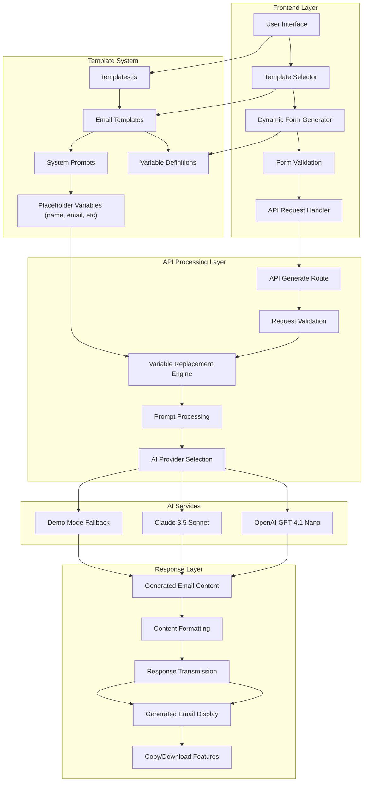

# AI Email Generator

A modern, professional email generator powered by the latest AI models including **GPT-4.1 Nano** that helps you create compelling business emails, cold outreach, customer support responses, and more in seconds.


## ✨ Features

### 🤖 Latest AI Models

- **GPT-4.1 Nano**: Fastest and cheapest model in GPT-4.1 series (Default)
  - 1M token context window
  - 32K output tokens
  - Optimized for low-latency tasks
  - $0.10/M input + $0.40/M output tokens
- **Claude 3.5 Sonnet**: Latest Anthropic model for high-quality outputs
- **Multiple Model Support**: Choose from various OpenAI and Anthropic models

### 📝 Smart Templates

- **Business Templates**: Professional emails, meeting requests, follow-ups
- **Sales Templates**: Cold outreach, partnership proposals
- **Support Templates**: Customer service responses, issue resolution
- **Personal Templates**: Job applications, event invitations

### 🎯 Dynamic Variables

- Customizable form fields for each template
- Real-time validation and progress tracking
- Smart input types (text, textarea, select, multiselect)

### 💎 Modern UI/UX

- Stunning gradient backgrounds and animations
- Responsive design for all devices
- Dark mode support
- Glass morphism effects and micro-interactions

### ⚡ Advanced Features

- Copy to clipboard functionality
- Download generated emails as text files
- Email statistics (word count, reading time)
- Multiple format views (formatted/raw text)
- Form validation and error handling

## 🚀 Quick Start

### Prerequisites

- Node.js 18+
- npm or yarn

### Installation

1. **Clone the repository**

   ```bash
   git clone <repository-url>
   cd email-template-generator
   ```

2. **Install dependencies**

   ```bash
   npm install
   ```

3. **Set up environment variables** (Optional for API integration)

   ```bash
   cp .env.example .env.local
   ```

   Add your API keys:

   ```env
   OPENAI_API_KEY=your_openai_api_key_here
   ANTHROPIC_API_KEY=your_anthropic_api_key_here
   ```

4. **Run the development server**

   ```bash
   npm run dev
   ```

5. **Open your browser**
   Navigate to [http://localhost:3000](http://localhost:3000)

## 🎯 Usage Guide

### 1. **Choose a Template**

- Browse featured templates or search by category
- Filter by business, personal, marketing, support, or sales
- Each template shows required fields and tags

### 2. **Fill in Details**

- Complete the dynamic form with your specific information
- Progress indicator shows completion status
- Real-time validation ensures data quality

### 3. **Generate Email**

- AI processes your inputs and generates professional email
- View formatted or raw text versions
- Copy, download, or edit as needed

### Available Templates

| Template                    | Category | Use Case                           |
| --------------------------- | -------- | ---------------------------------- |
| Professional Business Email | Business | General business communication     |
| Cold Outreach Email         | Sales    | Sales prospecting and networking   |
| Customer Support Response   | Support  | Customer service inquiries         |
| Job Application Email       | Personal | Job applications and cover letters |
| Event Invitation            | Personal | Professional and social events     |

## 🛠️ Technical Stack

- **Framework**: Next.js 15 with App Router
- **Language**: TypeScript
- **Styling**: Tailwind CSS with custom animations
- **UI Components**: Custom component library
- **AI Integration**: OpenAI GPT & Anthropic Claude APIs
- **State Management**: React hooks
- **Deployment**: Vercel-ready

## 🏗️ Architecture & Data Flow

### Process Overview

The AI Email Generator follows a streamlined architecture that transforms user input into AI-generated emails through a sophisticated template system.

### Data Flow Process



### Step-by-Step Process

#### 1. **Template Selection & Form Generation**

- User selects from predefined templates in `app/data/templates.ts`
- Each template contains:
  ```typescript
  {
    systemPrompt: "You are an expert email writer...",
    variables: [
      {
        name: "recipientName",
        label: "Recipient Name",
        type: "text",
        required: true
      }
    ]
  }
  ```
- `DynamicForm.tsx` renders form fields based on template variables

#### 2. **User Input Collection**

- Dynamic form validates input in real-time
- Form data structure:
  ```typescript
  {
    template: EmailTemplate,
    variables: { [key: string]: string },
    provider: "openai" | "anthropic",
    model?: string
  }
  ```

#### 3. **API Request Processing**

- POST request sent to `/api/generate`
- Backend validates request structure
- Variables extracted from form submission

#### 4. **System Prompt Processing**

The core transformation happens in `app/api/generate/route.ts`:

```typescript
// Original template prompt with placeholders
let processedPrompt = template.systemPrompt;
// "Write a {tone} email to {recipientName}..."

// Variable replacement engine
Object.entries(variables).forEach(([key, value]) => {
  const placeholder = `\\{${key}\\}`;
  if (value && value.trim() !== "") {
    // Replace {recipientName} with "John Smith"
    processedPrompt = processedPrompt.replace(new RegExp(placeholder, "g"), value);
  } else {
    // Remove empty placeholders
    processedPrompt = processedPrompt.replace(new RegExp(placeholder, "g"), "");
  }
});
```

#### 5. **AI API Integration**

**OpenAI Integration:**

```typescript
const response = await fetch("https://api.openai.com/v1/chat/completions", {
  method: "POST",
  headers: {
    Authorization: `Bearer ${OPENAI_API_KEY}`,
    "Content-Type": "application/json",
  },
  body: JSON.stringify({
    model: "gpt-4.1-nano", // Latest, fastest, cheapest
    messages: [
      {
        role: "user",
        content: processedPrompt, // Fully processed prompt
      },
    ],
    max_tokens: 4000,
    temperature: 0.6,
  }),
});
```

**Claude Integration:**

```typescript
const response = await fetch("https://api.anthropic.com/v1/messages", {
  method: "POST",
  headers: {
    "x-api-key": ANTHROPIC_API_KEY,
    "Content-Type": "application/json",
    "anthropic-version": "2023-06-01",
  },
  body: JSON.stringify({
    model: "claude-3-5-sonnet-20241022",
    max_tokens: 4000,
    messages: [
      {
        role: "user",
        content: processedPrompt,
      },
    ],
  }),
});
```

#### 6. **Response Processing & Display**

- AI-generated content returned to frontend
- `GeneratedEmail.tsx` displays formatted result
- Features: copy to clipboard, download as file, word count

### Template System Deep Dive

Templates define the AI behavior through carefully crafted system prompts:

```typescript
systemPrompt: `You are an expert email writer. Write a {tone} email that:
- Uses professional language appropriate for {relationship}
- Addresses {recipientName} directly
- Focuses on {purpose}
- Maintains {length} structure
- Ends with signature from {senderName}`;
```

### Variable Replacement Engine

The replacement engine handles:

- **Required variables**: Must be filled or generation fails
- **Optional variables**: Gracefully removed if empty
- **Validation**: Type checking and length limits
- **Sanitization**: Safe string replacement

### AI Model Selection Strategy

**GPT-4.1 Nano (Default)**:

- Optimized for speed and cost
- 1M context window, 32K output
- $0.10/M input + $0.40/M output tokens

**Claude 3.5 Sonnet**:

- Higher quality outputs
- Better reasoning capabilities
- Ideal for complex templates

**Demo Mode**:

- Fallback when no API keys provided
- Pre-generated examples based on template type

## 📁 Project Structure

```
app/
├── components/
│   ├── ui/                 # Reusable UI components
│   │   ├── Button.tsx
│   │   ├── Card.tsx
│   │   ├── Input.tsx
│   │   ├── Select.tsx
│   │   └── Textarea.tsx
│   ├── layout/            # Layout components
│   │   └── Header.tsx
│   └── generator/         # Generator-specific components
│       ├── TemplateSelector.tsx
│       ├── DynamicForm.tsx
│       └── GeneratedEmail.tsx
├── data/
│   └── templates.ts       # Email template definitions
├── types/
│   └── email.ts          # TypeScript interfaces
├── utils/
│   └── cn.ts             # Utility functions
├── api/
│   └── generate/
│       └── route.ts      # Email generation API
├── generator/
│   └── page.tsx          # Generator page
├── globals.css           # Global styles and animations
├── layout.tsx           # Root layout
└── page.tsx             # Home page
```

## 🎨 Customization

### Adding New Templates

1. **Define the template** in `app/data/templates.ts`:

   ```typescript
   {
     id: 'your-template-id',
     name: 'Your Template Name',
     category: 'business',
     description: 'Template description',
     systemPrompt: 'Your AI prompt with {variables}',
     variables: [
       {
         name: 'variableName',
         label: 'Display Label',
         type: 'text',
         required: true,
         placeholder: 'Placeholder text'
       }
     ],
     tags: ['tag1', 'tag2'],
     featured: false
   }
   ```

2. **Add demo email** in the API route (`app/api/generate/route.ts`)
3. **Test the template** in the generator

### Customizing Styles

The project uses Tailwind CSS with custom utility classes defined in `globals.css`:

- **Gradients**: `.gradient-text`, `.bg-gradient-1` through `.bg-gradient-5`
- **Animations**: `.fade-in`, `.slide-up`, `.scale-in`, `.floating`
- **Effects**: `.glass-effect`, `.hover-lift`, `.shimmer`

### Adding New Variable Types

1. **Update the interface** in `app/types/email.ts`
2. **Add rendering logic** in `app/components/generator/DynamicForm.tsx`
3. **Include validation** if needed

## 🔧 API Integration

### Supported Providers

- **OpenAI**:
  - `gpt-4.1-nano` (Default - Latest, fastest, cheapest)
  - `gpt-4o-mini` (Balanced performance/cost)
  - `gpt-4o` (High-quality outputs)
  - `gpt-3.5-turbo` (Legacy support)
- **Anthropic**:
  - `claude-3-5-sonnet-20241022` (Default - Latest model)
  - `claude-3-sonnet-20240229` (Previous version)
  - `claude-3-haiku-20240307` (Fast, lightweight)
- **Demo Mode**: Works without API keys

### Environment Variables

```env
OPENAI_API_KEY=sk-...           # OpenAI API key
ANTHROPIC_API_KEY=sk-ant-...    # Anthropic API key
```

## 🚀 Deployment

### Vercel (Recommended)

1. **Push to GitHub**
2. **Connect to Vercel**
3. **Add environment variables** in Vercel dashboard
4. **Deploy**

### Other Platforms

The app is a standard Next.js application and can be deployed to:

- Netlify
- AWS Amplify
- Railway
- DigitalOcean App Platform

## 🤝 Contributing

1. Fork the repository
2. Create your feature branch (`git checkout -b feature/amazing-feature`)
3. Commit your changes (`git commit -m 'Add amazing feature'`)
4. Push to the branch (`git push origin feature/amazing-feature`)
5. Open a Pull Request

## 📄 License

This project is licensed under the MIT License - see the [LICENSE](LICENSE) file for details.

## 🙏 Acknowledgments

- **OpenAI** for GPT models
- **Anthropic** for Claude models
- **Vercel** for Next.js and hosting
- **Tailwind CSS** for styling system
- **Heroicons** for beautiful icons

## 📞 Support

If you have any questions or need help:

- 📧 Email: support@emailgenerator.ai
- 💬 Discord: [Join our community](https://discord.gg/emailgenerator)
- 📱 Twitter: [@AIEmailGen](https://twitter.com/AIEmailGen)

---

**Made with ❤️ for better communication**
